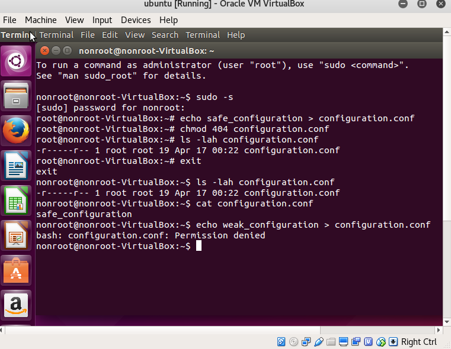

#Dirty Cow / CVE-2016-5195

##Bug Overview
A race condition was found in the way the Linux kernel's memory subsystem handled the copy-on-write (COW) breakage of private read-only memory mappings. An unprivileged local user could use this flaw to gain write access to otherwise read-only memory mappings and thus increase their privileges on the system.

##Discovery
[Phil Oester](http://www.v3.co.uk/v3-uk/news/2474845/linux-users-urged-to-protect-against-dirty-cow-security-flaw)

##Impact
An unprivileged local user could use this flaw to gain write access to otherwise read-only memory mappings and increase their privileges on the system. This results in bypassing the Discretionary Access Controls implemented in Linux.

##Simplified Issue
1. Kernel level flaw
2. COW means copy-on-write
3. Bug is in the implementation of COW in the Linux kernel
4. Programs can use race conditions to tamper with this buggy implementation to gain write access to any files.

##Theory
###Copy-on-write/Implicit sharing/Shadowing
It is a resource-management technique.

It is developed to share a modifiable resource amongst multiple processes.
COW efficiently implements copy of these resources to make the resource available.

It does so by the following technique:

If a resource is duplicated but not modified, it is not necessary to create a new resource; the resource can be shared between the copy and the original. Modifications must still create a copy, hence the technique: the copy operation is deferred to the first write. 

With this we can reduce the resource consumption of unmodified copies, while adding a small overhead to resource-modifying operations.

For example you have a block of data called A. 
Process 1, 2, 3, 4 each want to make a copy of it and start reading it, in a "Copy-on-write" system nothing is copied yet everything is still reading A. 
Now process 3 wants to make a change to it's copy of A, process 3 will now actually make a copy of A and create a new block of data called B. 
Process 1, 2, 4 are still reading block A process 3 is now reading B

###Practical example:
Linux uses it when it uses clone() to implement fork() - the parent process's memory(data and code segment) is COWed for the child.

Copy-on-write finds its main use in sharing the virtual memory of operating system processes, in the implementation of the fork system call. 

COW can be implemented efficiently using the page table by marking certain pages of memory as read-only and keeping a count of the number of references to the page. 

When data is written to these pages, the kernel intercepts the write attempt and allocates a new physical page, initialized with the copy-on-write data, although the allocation can be skipped if there is only one reference. 

The kernel then updates the page table with the new (writable) page, decrements the number of references, and performs the write. 

The new allocation ensures that a change in the memory of one process is not visible in another's. 

###Bug in COW implementation:
The bug here is a race condition in the code that does that copying. 

A race condition happens when two different processes or threads are accessing the same resource and step on each other.

It appears that there is a race condition in that copy (or actually in the bookkeeping around that copy) which is before the kernel separates pages that are marked dirty, it would let you write to the original page or memory is flagged to be writeable before it is actually copied. So if two threads are working very closely to each other, the second can take advantage of the writeable flag and actually write to the original memory, not the copy.

It happens in the following way:
Thread 1: Informs Operating system that some defined memory is no longer needed which can be moved out so that another process can use it.
Thread 2: Write as attacker what you want on that same defined memory location. In case of Linux, this would be a file on disk.

Now when this happens several times, there is a chance that what you write onto the memory is observed as dirty/modified by the kernel which ends up writing it to the disk. As the kernel is writing it to the disk, it has all the permissions to make the modifications.

Note: It is important to have read access to a fle to get it's contents, modify it appropriately and then write it to the disk.

##Exploits
1. [PoCs](https://github.com/dirtycow/dirtycow.github.io/wiki/PoCs)

##Demo
Consider the following scenario:

- There is a root owned configuration file to which you only have read access.
- It has a secure configuration for some service.

To compromise sensitive data you need to modify the configuration files.

By using Dirty C.O.W. exploit, you will be able to write to such a file and hence, compromise the integrity of the system.

Other alternative exploits which are publically available can help escalate privileges to root user.

##Distribution tracker
1. [Debian](https://security-tracker.debian.org/tracker/CVE-2016-5195)
2. [Ubuntu](http://people.canonical.com/~ubuntu-security/cve/2016/CVE-2016-5195.html)
3. [Redhat](https://access.redhat.com/security/cve/cve-2016-5195)
4. [SUSE](https://www.suse.com/security/cve/CVE-2016-5195/)

##Detection
Exploitation of this bug does not leave any trace of anything abnormal happening to the logs.

##Remediation
1. [Linux kernel](https://git.kernel.org/pub/scm/linux/kernel/git/torvalds/linux.git/commit/?id=19be0eaffa3ac7d8eb6784ad9bdbc7d67ed8e619)
2. [Patched kernel versions](https://github.com/dirtycow/dirtycow.github.io/wiki/Patched-Kernel-Versions)
3. [Vulnerability analysis](https://github.com/oleg-fiksel/ansible_CVE-2016-5195_check)
4. [Patching](https://www.digitalocean.com/community/tutorials/how-to-protect-your-server-against-the-dirty-cow-linux-vulnerability)

##References
1. [Official site](https://dirtycow.ninja/)
2. [CVE](https://cve.mitre.org/cgi-bin/cvename.cgi?name=CVE-2016-5195)
3. [Copy-on-Write Stackoverflow](https://stackoverflow.com/questions/628938/what-is-copy-on-write)
4. [Copy-on-write wikipedia](https://en.wikipedia.org/wiki/Copy-on-write)
5. [Dirty COW Stackoverflow](https://security.stackexchange.com/questions/140469/simple-explanation-of-how-dirty-cow-works)
6. [Threatpost](https://threatpost.com/serious-dirty-cow-linux-vulnerability-under-attack/121448/)
7. [Linux.com](https://www.linux.com/blog/how-bad-dirty-cow)
8. [Computerphile](https://www.youtube.com/watch?v=CQcgz43MEZg)